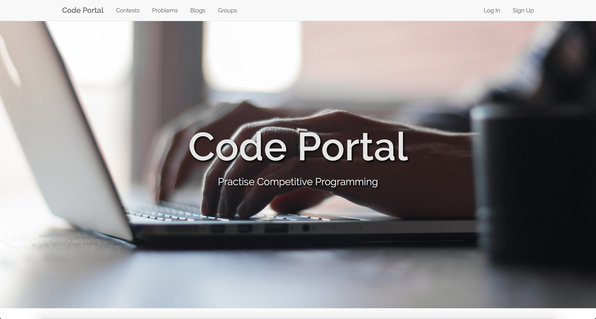

# CodePortal
Code Portal is a Laravel web application that gets you inside the competitive programming shell, where you can explore a tremendous amount of code-life-related problems. You can also join contests to improve your skills and to get in touch with other geeks, even better you can create the contests if you want to. Code portal offers way too many functionailties that every user may need, such as groups, problems sheets, group chatting and DMing, blogs, and much more...

### What are the main modules?
- Users
- Contests
- Groups
- Teams
- Notifications and invitations
- Problems
- Blogs

### What are the main features?
- Create new user account and manage your preferences.
- Practice and solve problems from different famous providers (e.g. Codeforeces, UVA, ...).
- Create public/private contests from the huge provided amount of problems, customize the contest to match your specific needs.
- Create groups of users and give them sheets of problems on specific topics that you select, you may also provice solutions to sheet problems in your preferred programming language.
- You can also create teams of 3 members and join contests.
- You can invite users to groups and as an admin you can respond to joining requests.
- You can write blogs about any topic you would like. You may also comment on blogs, vote blogs/comments, reply to comments, and much more.

### How to use?
- Clone this repository.
- Make sure you have php and mysql installed
- Migrate the databases using `php artisan migrate`
- Run the application using `php artisan serve`
- Navigate to the provided URL and enjoy.

### How are we unit testing?
- **phpunit:** to test the basic features and functionalities of database transactions.
    - To run these tests make sure you have phpunit framework installed, then run `phpunit`
- **Dusk:** to graphically test the overall website functions, which simulates human actions much better. 
    - To run these tests run `php artisan dusk`